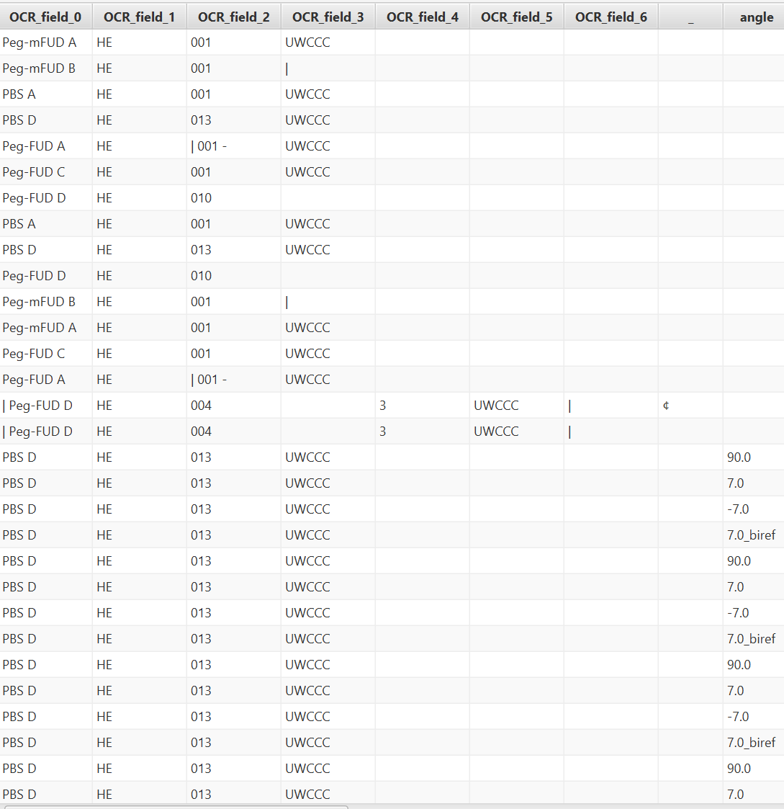

# QuPath Project Metadata Browser

A [QuPath](https://qupath.github.io) extension that opens a table view of
every image in the current project, with every built-in field and user
metadata key as a sortable, filterable column. Modelled on QuPath's
built-in TMA Results Viewer, but for whole projects.

**New in v0.2.0:** project-wide metadata-key rename and removal via the
new Metadata Keys tab. See [user guide](docs/user-guide.md#metadata-keys-tab).


## Features

- One row per `ProjectImageEntry`; built-in columns (Name, ID, URI,
  Description, Tags) plus one column per user-metadata key used anywhere
  in the project.


- Global case-insensitive **Filter rows** search and per-column sort.
- **Fit Columns** button auto-sizes each visible column to its widest
  content, capped at the **Max column width** preference at the bottom
  of the window. Cells longer than the cap wrap to multiple lines so
  nothing is truncated. The cap is saved across QuPath sessions.
- **Columns** menu lists every column as a checkbox plus **Select All**
  and **Select None** for bulk show/hide of large metadata keysets.
- Multi-row selection with Ctrl+C (TSV) and export to CSV (default) or TSV.
- Double-click or right-click > Open image.
- Right-click > Edit metadata... for per-image editing, persisted via
  `project.syncChanges()`. For project-wide rename or removal of a
  metadata key, see the **Metadata Keys** tab.
- **Metadata Keys** tab (new in v0.2.0) lists every distinct metadata
  key in the project with a usage count, and lets you **rename** a key
  across every image, or **remove** it from every image, in one
  operation. Destructive actions are gated behind a no-undo
  confirmation. See the [user guide](docs/user-guide.md#metadata-keys-tab)
  for step-by-step. Inspired by sebg's request on the QuPath community
  forum ([thread](<FORUM_THREAD_URL>)).
  <!-- TODO: backfill <FORUM_THREAD_URL> at release time; the forum URL
       was not known at Phase 2 (see metadata-keys-tab/02b_design_docs.md
       Blocking questions). -->
- Refresh (F5) picks up metadata added by scripts or acquisitions while
  the browser is open.

## Install

Drop the shadow JAR from `build/libs/` into QuPath's `extensions/`
folder, or drag it onto the main QuPath window.

## Use

**Extensions > Project Metadata Browser > Browse Metadata...**

## Build

```
./gradlew shadowJar
```

Requires QuPath 0.6.0+ and Java 21.

## Support

For general support and feature requests, please post on the [image.sc forum](https://forum.image.sc/) with the `#qupath` tag and mention `@Mike_Nelson` to flag the topic for my attention.

## Source / prior art

The project-wide rename script that the Metadata Keys tab's rename
operation is modelled on was written by Pete Bankhead and shared on
the QuPath community forum thread linked above (request by sebg).
The tab generalizes that script and adds the matching removal
operation, a usage count per key, and a no-undo confirmation gate.
Forum thread: <FORUM_THREAD_URL>.
<!-- TODO: backfill <FORUM_THREAD_URL> at release time. -->

## License

Apache License 2.0 -- see [LICENSE](LICENSE).
