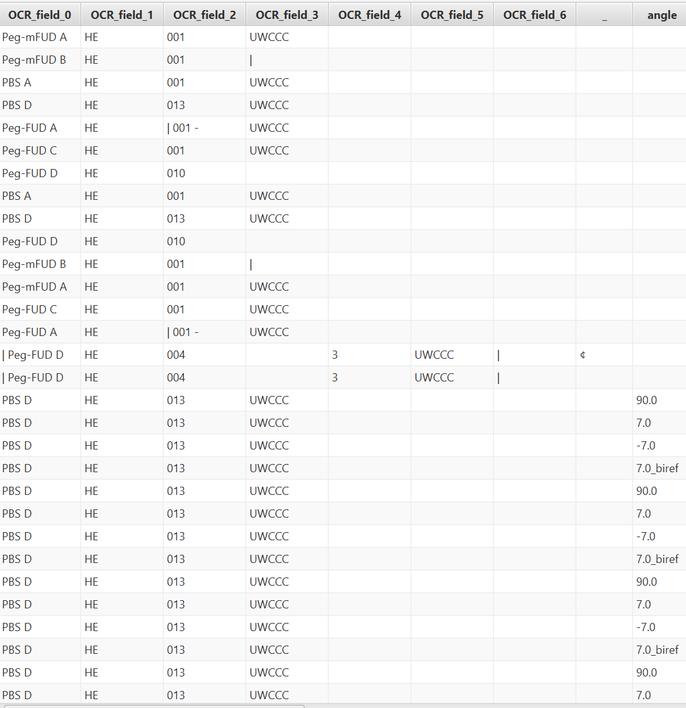

# QuPath Project Metadata Browser

A [QuPath](https://qupath.github.io) extension that opens a table view of
every image in the current project, with every built-in field and user
metadata key as a sortable, filterable column. Modelled on QuPath's
built-in TMA Results Viewer, but for whole projects.

**New in v1.1:** the browser is now a buffered editor -- your edits stay
in memory until you click **Save**, and every action (cell edit, rename,
paste, import, regex extract) is undoable. New workflows in this release:
template export + reimport for partner-supplied metadata, Excel-style
copy/paste, and regex extraction from filenames. See
[Buffered editing in v1.1](docs/user-guide.md#buffered-editing-and-save--discard)
in the user guide.

**Coming from v0.2.0?** The browser now works as a buffered editor: your
edits accumulate in a working copy and commit to disk only when you click
**Save**. Rename, delete, per-image edits, inline cell edits, paste,
import, and regex extraction all behave this way. The upside: anything
you do is undoable with Ctrl+Z before you save, and the close prompt
asks before discarding unsaved work. The on-disk project is untouched
until Save.

![Project Metadata Browser window on a 467-image project of polarized-light acquisitions, sorted by Name. A Name column is followed by five tinted read-only columns tagged [image] (Image type, Pixel size, Size, Channels, Magnification) and then the editable project keys angle, modality and objective. Each acquisition has four angle images; the single-channel birefringence image is typed Other while its three-channel siblings are Brightfield (H&E). The toolbar holds the Filter rows box, Refresh, Fit Columns and the Image metadata checkbox; the footer shows 467 shown / 467 total, Max column width, Export and Close.](images/metadata-browser-window.png)

*A real 467-image project. The tinted `[image]` columns are read from the
images; `angle`, `modality` and `objective` are project metadata keys.
Magnification is blank because these OME-TIFFs do not record one. Other
columns are hidden via the Columns menu.*

## Features

- One row per `ProjectImageEntry`; built-in columns (Name, ID, URI,
  Description, Tags) plus one column per user-metadata key used anywhere
  in the project.


- Global case-insensitive **Filter rows** search and per-column sort.
- **Fit Columns** button auto-sizes each visible column to its widest
  content, capped at the **Max column width** preference at the bottom
  of the window. Cells longer than the cap wrap to multiple lines so
  nothing is truncated. The cap is saved across QuPath sessions.
- **Columns** menu lists every column as a checkbox plus **Select All**
  and **Select None** for bulk show/hide of large metadata keysets.
- Multi-row selection with Ctrl+C (TSV) and export to CSV (default) or TSV.
- Double-click or right-click > Open image.
- Right-click > Edit metadata... for per-image editing. In v1.1 the edit
  lives in the working copy and is committed on Save (no longer
  immediately on dialog OK). Undoable.
- **Metadata Keys** tab lists every distinct metadata key in the project
  with a usage count, and lets you **rename** a key across every image,
  or **remove** it from every image, in one operation. In v1.1 both
  actions go on the undo stack and commit on Save. See the
  [user guide](docs/user-guide.md#metadata-keys-tab) for step-by-step.
  Originating from a request by `sebg` (with Pete Bankhead's per-project
  rename script) on the QuPath community forum at
  [image.sc](https://forum.image.sc/).
- **Buffered editor + undo / redo (new in v1.1).** Edits live in a
  working copy until you click **Save**. Every action is undoable
  (Ctrl+Z) and redoable (Ctrl+Shift+Z); Discard reverts to the last
  saved state.
- **Template export + reimport (new in v1.1).** **File > Export >
  Template for fill-in...** writes a CSV (or TSV) of Image ID + Name +
  existing-and-blank columns for a collaborator to fill in Excel.
  **File > Import metadata...** opens a 3-step wizard with a dry-run
  preview of adds / updates / left-alone rows.
- **Excel copy/paste (new in v1.1).** Copy a block out of Excel, click
  a cell, paste. Clipboard fills rightward and downward; overflow past
  the table edge is clipped with a warn count.
- **Regex extraction from filenames (new in v1.1).** **Edit > Extract
  columns from filenames...** opens a dialog with a live preview.
  Write a regex with named groups (`(?<patient>P\d+)`) -- each named
  group becomes a new metadata column. Existing-column collisions
  reuse the v0.2.0 rename's Overwrite / Skip / Cancel policy.
- Refresh (F5) picks up metadata added by scripts or acquisitions while
  the browser is open. Disabled while there are unsaved edits.
- **Image metadata columns (new in v1.1.0).** Five read-only columns
  tagged `[image]` and tinted so they read as a different kind of column
  from the editable keys: **Image type** (H&E, fluorescence, ...),
  **Pixel size**, **Size** (W x H, plus z / t depth), **Channels** (count;
  names in the tooltip) and **Magnification**. Sort on Image type to
  group a mixed project by modality. The **Image metadata** checkbox in
  the toolbar shows or hides all five at once (saved across sessions).
  Pixel size, size, channels and magnification come from the project
  file; image type is read from each entry's data file in the background
  without loading its objects. Right-click > **Set image type...** changes
  the type on the selected entries -- this rewrites their data files and
  is not undoable from the browser, so it asks first. See the
  [user guide](docs/user-guide.md#image-metadata-columns).

## Install

Drop the shadow JAR from `build/libs/` into QuPath's `extensions/`
folder, or drag it onto the main QuPath window.

## Use

**Extensions > Project Metadata Browser > Browse Metadata...**

## Build

```
./gradlew shadowJar
```

Requires QuPath 0.7.0+ and Java 21.

## Support

For general support and feature requests, please post on the [image.sc forum](https://forum.image.sc/) with the `#qupath` tag and mention `@Mike_Nelson` to flag the topic for my attention.

## Source / prior art

Thanks to the people whose work this extension builds from:

- **Egor Zindy** (`@EP.Zindy`) for
  [`zindy/qupath-extension-project-metadata-editor`](https://github.com/zindy/qupath-extension-project-metadata-editor),
  the broader and more actively-developed metadata editor for QuPath
  (undo / redo, column add / rename / remove / copy, regex extraction
  from filenames, Search & Replace, train / val / test split, CSV
  import / export). **If you are not already on the
  `qupath-catalog-mikenelson` catalog, start there.** This extension's
  v1.0.0 buffered-editor architecture and CellProfiler-style
  regex-from-filenames workflow come directly from his work and from
  his description in the
  **[QuPath Metadata](https://forum.image.sc/t/qupath-metadata/80733/6)**
  thread on image.sc (post #6 onward).
- **Pete Bankhead** for QuPath itself, and for the per-project rename
  script that the v0.2.0 Metadata Keys tab's rename operation generalizes,
  shared on the QuPath community forum at
  [image.sc](https://forum.image.sc/) in response to a request by `sebg`.
- The buffered-editor pattern itself (working copy + Command-pattern
  undo / redo + commit on explicit Save) is the design QuPath core's
  own built-in project-metadata editor used before it was extracted
  upstream, and is the same architectural choice Zindy makes. It is
  not original to either project.

This extension continues to ship because it is already in the
`qupath-catalog-mikenelson` catalog alongside the rest of the LOCI
tooling. Its feature set is narrower than Zindy's; users who want a
fuller project-metadata editor should prefer his extension.

## License

[GNU General Public License v3.0](LICENSE)

This extension depends on [QuPath](https://qupath.github.io), which is
licensed under GPL v3, so the running combination of QuPath + this
extension is itself GPL v3. It also occupies the same problem space as
Zindy's GPL v3
[`qupath-extension-project-metadata-editor`](https://github.com/zindy/qupath-extension-project-metadata-editor)
and adopts the same buffered-editor architecture used there and in
QuPath core. We license this extension under the same terms so the
ecosystem stays consistent. (Earlier releases through v1.0.0 carried
an Apache-2.0 header; the source files are now GPL v3.)
